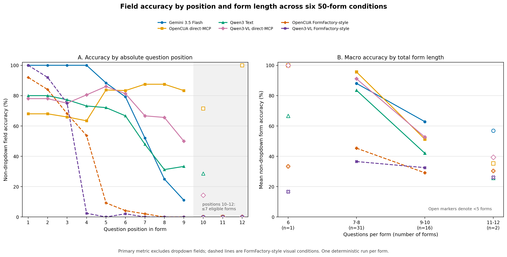

# Form Length and Question Position Analysis

## Technical summary

The six completed conditions use the same 50 forms and 409 form/question pairs. All forms contain at least six questions; the mean is 8.18, the median is 8, and the range is 6–12. Forty-seven of the 50 forms contain 7–10 questions.

The two FormFactory-style visual conditions show the clearest absolute-position collapse. OpenCUA falls from 92% non-dropdown accuracy at question 1 to 9.3% at question 5, while Qwen3-VL falls from 100% at question 1 to 2.4% at question 4. Gemini, Qwen3 Text, and Qwen3-VL direct-MCP also deteriorate at later positions, but OpenCUA direct-MCP is a counterexample: its position curve is non-monotonic even though its performance is lower on longer forms. The evidence is therefore descriptive and does not isolate form length from widget composition or position.

The primary analysis excludes dropdowns because the historical four-model cohort and later visual runs used different dropdown-verifier versions. Each condition contributes 384 comparable non-dropdown fields. Confidence intervals use 10,000 form-level bootstrap samples and describe variation across these fixed forms, not decoding randomness.



The left panel uses absolute question positions. Open markers at positions 10–12 denote fewer than ten eligible forms. The right panel reports macro per-form accuracy so longer forms do not receive extra weight; the 6-question group contains one form and the 11–12-question group contains only two.

## Comparable summaries

| Condition | Overall non-dropdown | First three, macro | Last three, macro | Late − early | 7–8 questions | 9–10 questions |
|---|---:|---:|---:|---:|---:|---:|
| Gemini 3.5 Flash | 77.08% | 100.00% | 53.33% | -46.67 pp | 88.06% | 62.83% |
| OpenCUA direct-MCP | 75.52% | 68.00% | 94.00% | +26.00 pp | 95.62% | 51.27% |
| Qwen3 Text | 64.58% | 80.00% | 53.67% | -26.33 pp | 83.51% | 42.00% |
| Qwen3-VL direct-MCP | 73.70% | 77.33% | 72.00% | -5.33 pp | 91.11% | 52.64% |
| OpenCUA FormFactory-style | 38.28% | 82.67% | 2.67% | -80.00 pp | 45.35% | 29.13% |
| Qwen3-VL FormFactory-style | 34.11% | 90.00% | 0.00% | -90.00 pp | 36.54% | 32.52% |

The first/last comparison uses the structural first three and last three questions of every form. Because widget types are not evenly distributed by position, these differences should not be interpreted as a causal effect of scrolling or sequence length.

## Model-specific findings

### Gemini 3.5 Flash

Non-dropdown accuracy is 77.08%. It remains 100% at question 1 and 100% at question 4, then falls to 25% at question 8 and 0% at question 10. Macro accuracy is 88.1% on 7–8-question forms versus 62.8% on 9–10-question forms.

### OpenCUA direct-MCP

Non-dropdown accuracy is 75.52%. Its positional pattern is not monotonic: accuracy is 68% at question 1, rises to 87.5% at question 7, and remains 83.3% at question 9. Nevertheless, macro form accuracy drops from 95.6% for 7–8 questions to 51.3% for 9–10 questions. This contrast shows that total form length, field composition, and absolute position cannot be treated as the same effect.

### Qwen3 Text

Non-dropdown accuracy is 64.58%. Accuracy declines from 80% at question 1 to 47.9% at question 7 and 28.6% at question 10. Macro accuracy is 83.5% on 7–8-question forms and 42.0% on 9–10-question forms.

### Qwen3-VL direct-MCP

Non-dropdown accuracy is 73.70%. It is relatively stable through question 6, then falls from 66.7% at question 7 to 14.3% at question 10. Macro accuracy falls from 91.1% for 7–8 questions to 52.6% for 9–10 questions.

### OpenCUA FormFactory-style

Non-dropdown accuracy is 38.28%. The positional collapse is sharp: 92% at question 1, 53.7% at question 4, 9.3% at question 5, and 0% from question 8 onward. The trace audit found no scrolling actions, so later-position failure is consistent with viewport traversal failure rather than answer extraction alone.

### Qwen3-VL FormFactory-style

Non-dropdown accuracy is 34.11%. It falls from 100% at question 1 and 75% at question 3 to 2.4% at question 4 and 0% at question 5. The same qualitative failure across two visual models strengthens the interpretation that the screenshot-coordinate workflow is the shared stressor.

## Scope and method

The form-count distribution is: 1 form(s) with 6 questions, 17 form(s) with 7 questions, 14 form(s) with 8 questions, 11 form(s) with 9 questions, 5 form(s) with 10 questions, 1 form(s) with 11 questions, 1 form(s) with 12 questions. Accuracy is final verified browser-state correctness. Position curves are field-weighted; form-length curves and first/last summaries use macro per-form averages. Bootstrap sampling treats the form as the independent resampling unit.

The six cohorts were loaded only from the explicit analysis manifest. Validation requires exactly 50 forms, 409 unique form/question keys, 384 non-dropdown fields, no duplicates, and an identical question index, total, and widget type for every key.

## Limitations and robustness

- Form length, widget type, viewport location, and question position are correlated. These cuts identify stress patterns but do not estimate independent causal effects.
- Positions 10, 11, and 12 contain at most 7, 2, and 1 eligible forms respectively. The 11–12-question bucket contains only two forms.
- There is one temperature-zero run per form. Bootstrap intervals measure across-form heterogeneity, not stochastic model variability.
- Direct-MCP and visual actions have different granularity and observation contracts. The comparison supports claims about these implemented protocols, not an interface-independent model ranking.

## Minimal FormFactory fidelity improvement

A pixel-ruler overlay is the smallest paper-aligned change because it preserves the screenshot-coordinate task and action grammar. It should be evaluated as an isolated ruler ablation with all other settings unchanged. It may improve coordinate grounding, but it is unlikely to solve the dominant lack of scrolling by itself.

Automatic scrolling, detailed verifier feedback, multi-action page plans, 2880×1800 rendering, the official FormFactory input documents, submission, and the paper's Click/Value metrics would materially change the workflow. Those changes belong in a separately named replication rather than being folded into this baseline.

## Reproduction

```bash
MPLCONFIGDIR=/tmp/form-length-position-mpl python3 scripts/analyze_form_length_position.py \
  --project-root . \
  --config configs/baselines/form_length_position_analysis.json \
  --output-dir docs/eval_results/form_length_position_analysis
```

The machine-readable tables and analysis manifest are stored beside this report.
